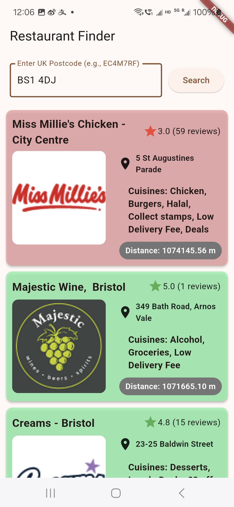
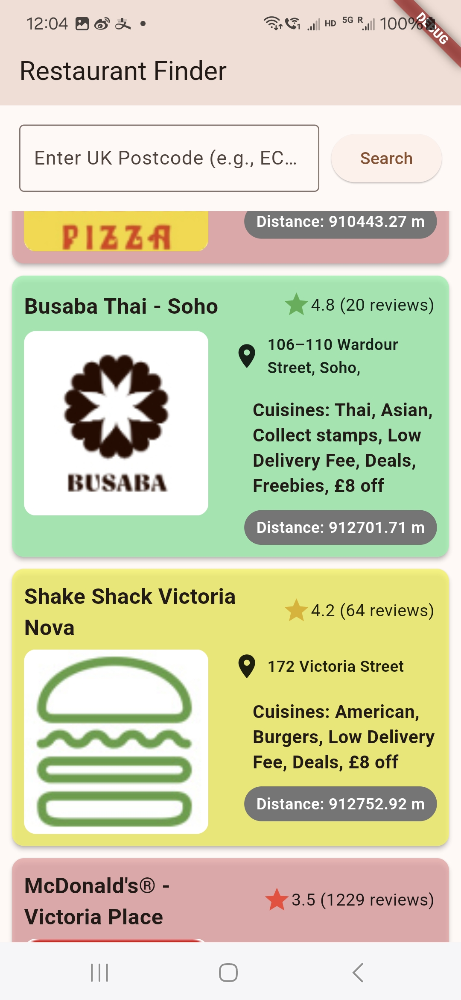
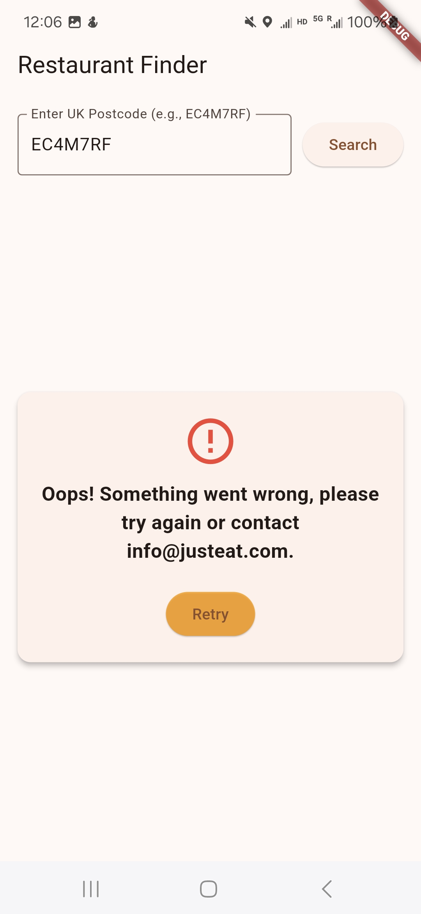

# Restaurant Finder
A Flutter mobile app mockup for the Just Eat Takeaway.com coding assignment.

## Demo Screenshots
- Search for PostCode

    
- Color Distinguish Rating Level of Restaurants

    
- Error Handling ofr Data Fetch
    
    

## How to Run
1. Install Flutter (see [official docs](https://flutter.dev/docs/get-started/install)).
2. Clone this repo: `git clone <your-repo-url>`.
3. Navigate to the folder: `cd restaurant_finder`.
4. Install dependencies: `flutter pub get`.
5. Launch an emulator: `flutter emulators --launch <emulator-id>`.
6. Run the app: `flutter run`.

## Assumptions
- Hardcoded default postcode "SW1A1AA" for simplicity.
- Used `address.firstLine` for the address field; Next step: expand to include city/postcode.
- Assumed `cuisines` contains relevant names despite some being tags (e.g., "Deals").

## Implementations
This Flutter app fetches restaurant data from the Just Eat Takeaway.com API and displays the first 10 restaurants in a mobile-friendly interface. Below are the key implementation details:

### Project Structure
``` MVVM architecture
lib/
├─ services/                          
|    ├─ user_location_service.dart   // Native
│    └─ restaurant_service.dart   // Only handles HTTP, decoding, and logging.
|
├─ repositories/                  // business logic, mapping, caching
|    ├─ user_location_repository.dart
│    └─ restaurant_repository.dart       
|
├─ models/
|    └─ restaurant.dart          // generated by json_serializable
|
├─ screens/                   // UI View
│    └─ features/
|        ├─ widgets/          // local widgets specific to this feature screen
│        └─ restaurant_screen.dart 
| 
├─ widgets/                  // Shared widgets
|    ├─ main_button.dart
|    ├─ user_location_aware.dart
|    ├─ error_card.dart
|    └─ search_bar.dart   
|
└─ errors/
     └─ location_errors.dart        

```
**`Service`**: Encapsulate functionality beyond the app's boundaries, such as:
  - REST APIs
  - Databases
  - OS services like Contacts/Calendar
  - Hardware features like location and acceleration sensors
**`Repositories`**: Convert data from/to the external data format (e.g., JSON) to domain objects, Business logic, CRUD
**`Models`**: Data objects, Keep alignment of domain objects within the app, procide to/from JSON that Services can use
**`Screens`**: Full Page or high-level Widget that fully implements a specific feature.
  - Organized by features or screen function.
  - A feature folder contains all the widgets, screen layout needed for that feature.
**`Errors`**: Models the `rating` object with `count`, `starRating`, and `userRating`.
**`Widgets`**: Include all widgets used on more than one page
- **`lib/screens/home_screen.dart`**: Renders the UI using a `ListView` of `Card` widgets.

### API Integration
- **Endpoint**: The app uses `https://uk.api.just-eat.io/discovery/uk/restaurants/enriched/bypostcode/` to fetch data.
- **HTTP Client**: The `http` package (version 0.13.5) is used to make GET requests.
- **Parsing**: The JSON response is decoded in Repository class, and the `restaurants` array is limited to the first 10 entries using `.take(10)`.

### Data Parsing in `Restaurant` Model
The `Restaurant` class uses `json_annotation` and `json_serializable`:
- **Dependencies**: `json_annotation: ^4.8.1`, `json_serializable: ^6.7.1`, `build_runner: ^2.4.6`.
- **Code Generation**: Run `flutter pub run build_runner build --delete-conflicting-outputs`.
- **Fields**:
  - `name`: Direct mapping with a default.
  - `cuisines`: Custom parsing extracts `name` from each cuisine object.
  - `rating`: Nested `Rating` object parsed automatically.
  - `address`: Nested `Address` object parsed automatically.

- **Rating**
**Model**: `Rating` class with `count` (int), `starRating` (double), and `userRating` (nullable double).
**Parsing**: Handled by `json_serializable` via `Rating.fromJson`.
**Display**: Uses `starRating` in the UI as the numeric rating required by the assignment.

- **Address**:  Taken from `json['address']['firstLine']` (e.g., "62 Upper Street"). Defaults to "No address available" if absent.
  ```dart
  address: json['address']?['firstLine'] ?? 'No address available',
  ```
1. Create Location model strong the coordinates fetched from API, and toGeoPoint() function which returns the cloud_firestore GeoPoint type from Firebase
2. Added a GeoUtil file to calculate the distance  between two geographical points using the Haversine formula

### UI Design
- Widget Choice: A FutureBuilder manages the asynchronous API call, displaying a loading spinner, error message, or the restaurant list based on the state.
- Restaurant Display: Each restaurant is shown in a Card widget with:
name in bold as the title.
address, rating, and cuisines listed vertically below.
cuisines joined into a comma-separated string (e.g., "Burgers, Chicken, Halal").
- Styling: Basic padding and font adjustments ensure a clean, readable layout.

### Error Handling
- Checks for HTTP status codes (e.g., 200 OK) and throws exceptions for failures.
- Uses null-safe operators (?., ??) to handle missing or null fields gracefully.

### Key Decisions
- Nested Models: Added `Address`, `Location`, and `Rating` models for better structure and reusability.
- Hardcoded Postcode: Chose "SW1A1AA" to focus on displaying data rather than building an input system, per the assignment’s emphasis on presentation.
- Minimal Dependencies: Only added http to keep the app lightweight.
- Card Layout: Opted for Card over ListTile for a more modern, mobile-app aesthetic.

## Improvements
- [x] Add a text field for user-input postcodes and fetch the corresponding location.
- [x] Enhance UI with colors or icons (e.g., star for rating).
- [x] Handle edge cases like missing data more gracefully.
- [x] Add GeoPoint for location, and ask and get user's location permission for calculating the distances.
- [x] Add an avatar
- [x] Create features branch and go through pull-request procedures.
- [ ] Add unit test.
- [ ] Set the default postcode based on user location.